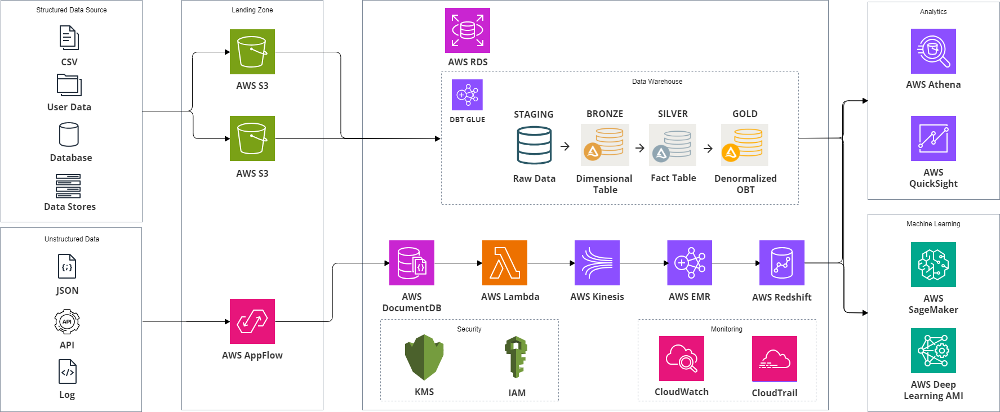

# Data-Modelling-Healthcare

Project Overview
This project focuses on optimizing healthcare data architecture using dimensional modelling, data warehousing, and real-time data processing. The goal is to create a scalable, efficient system for handling structured and unstructured healthcare data while supporting advanced analytics and machine learning workflows. The architecture leverages AWS services, combining traditional relational databases with real-time data streaming from NoSQL sources.

Key Technologies Used:
AWS S3: Centralized storage for structured data (CSV, databases).
Amazon DocumentDB: Stores unstructured data like JSON from third-party APIs.
AWS Lambda & Kinesis: Real-time data processing pipelines.
Amazon Redshift: Core data warehouse for analytical queries.
Amazon RDS (PostgreSQL): Traditional relational database supporting dimensional and fact tables.
AWS Glue & dbt: ETL pipelines and data transformation.
Amazon Athena, QuickSight, SageMaker: Analytics and machine learning services.
Data Modelling Approach:
We adopted a Medallion Architecture that structures data across four layers—Staging, Bronze, Silver, and Gold—with the use of dimensional models and One Big Table (OBT) methodologies for optimized analytics.

Staging Layer: Initial repository for raw data.
Bronze Layer: Transforms raw data into dimensional tables (e.g., DIM_CLINIC, DIM_PATIENT).
Silver Layer: Constructs fact tables that aggregate data from dimensional tables (e.g., FACT_APPOINTMENT).
Gold Layer: A denormalized table (OBT) that merges dimension and fact tables for high-performance analytics.
Schema Design
The healthcare data model follows a star schema with separated fact and dimension tables:

Fact Tables: Store measurable data (e.g., FACT_APPOINTMENT, FACT_PREDICTION) with foreign keys linking to dimension tables.
Dimension Tables: Store descriptive data (e.g., DIM_APPOINTMENT, DIM_CLINIC, DIM_PATIENT) enabling filtering and aggregation.
Use Cases
Clinic Performance: Identifying best-performing clinics by tracking delays between scheduled and actual appointment times.
Predicting Missed Appointments: Aggregating no-shows based on clinic location using predictions.
Tracking No-Shows: Analyzing missed appointments over time using DIM_DATE and DIM_TIME.
Optimization Strategies
Partitioning: Data is partitioned by clinic_id and scheduled_month for better performance.
Indexing: Foreign keys like appointment_id, clinic_id, and scheduled_date_id are indexed for faster queries.
Real-Time Data Integration
Unstructured data from APIs is ingested into Amazon DocumentDB and streamed in real-time to Amazon Kinesis using AWS Lambda. Apache Spark on Amazon EMR performs transformations and joins the data with existing structured data in Amazon RDS.

Machine Learning Integration
Processed data is stored in Amazon Redshift and fed into Amazon SageMaker for building and deploying machine learning models, such as predicting patient no-shows or analyzing appointment trends.

Monitoring and Security
AWS CloudWatch and CloudTrail: Real-time monitoring of system performance and API call tracking.
AWS IAM & KMS: Ensuring secure access and encryption of sensitive data.
Conclusion
This healthcare data modelling project optimizes both transactional and analytical workloads using a combination of AWS services, dimensional modelling, and real-time data processing. By implementing the One Big Table (OBT) methodology and Medallion Architecture, we reduce complexity and enable faster analytics and machine learning capabilities.
